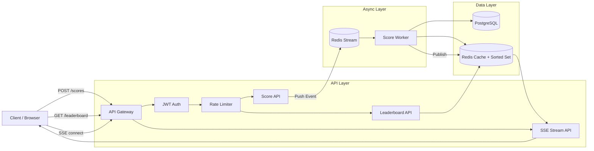

# Real-Time Scoreboard Backend Module

---

## 1. Overview

This module implements a real-time scoreboard system that maintains the Top 10 users by score.

Users perform actions → scores are updated → leaderboard recalculated → pushed to clients in real time.

### Goals

- Correctness & consistency
- Real-time updates
- Anti-cheat & security
- High performance
- Horizontal scalability

---

## 2. System Architecture

### Components

- API Gateway (stateless)
- Score Service
- Leaderboard Service
- Realtime Service (SSE)
- Worker Service (async processing)
- PostgreSQL (source of truth)
- Redis (cache + leaderboard + stream)
- Redis Streams (message queue)

---

## 3. Architecture Diagram



---

## 4. Execution Flow

### 4.1 Score Update Flow (Async)

1. Client calls `POST /scores`
2. API validates JWT, input, idempotency key
3. API pushes event to Redis Stream
4. Worker consumes event:
   - Validate action
   - Compute score
   - Update DB (transaction)
   - Update Redis leaderboard
   - Publish update event
5. SSE pushes update to clients

---

### 4.2 Leaderboard Fetch Flow

1. Client calls `GET /leaderboard`
2. API reads from Redis
3. If miss → fallback DB → update cache
4. Return top 10

---

### 4.3 Realtime Flow

1. Client connects to SSE
2. Server keeps connection open
3. On update:
   - read Redis top 10
   - push to clients
4. Client auto reconnects

---

## 5. API Specification

### 5.1 POST /scores

#### Request

Headers:

Authorization: Bearer <jwt>  
Content-Type: application/json  

```json
{
  "actionId": "action-123",
  "idempotencyKey": "uuid"
}
```

#### Rules

- Do NOT accept score from client
- Score computed server-side
- idempotencyKey required

#### Response

```json
{
  "success": true,
  "message": "Score update accepted"
}
```

---

### 5.2 GET /leaderboard

```http
GET /leaderboard
```

```json
{
  "success": true,
  "data": {
    "top10": [
      {
        "userId": "u1",
        "score": 1000,
        "rank": 1
      }
    ]
  }
}
```

---

### 5.3 GET /leaderboard/stream

SSE event:

```
data: {"top10":[{"userId":"u1","score":1000,"rank":1}]}
```

---

## 6. Data Design

---

### 6.1 PostgreSQL

---

#### Table: users

| Column        | Type           | Constraints                          | Description |
|--------------|---------------|--------------------------------------|------------|
| id           | UUID          | PK                                   | User ID |
| total_score  | BIGINT        | NOT NULL DEFAULT 0                   | Total accumulated score |
| rank         | INT           | NULL                                 | Cached rank (optional for quick read) |
| status       | VARCHAR(20)   | NOT NULL DEFAULT 'ACTIVE'            | User status |
| created_at   | TIMESTAMP     | NOT NULL DEFAULT now()               | Created time |
| updated_at   | TIMESTAMP     | NOT NULL                             | Last update |

Indexes:

- PK (id)
- INDEX idx_users_score (total_score DESC)

---

#### Table: score_events

| Column            | Type           | Constraints                          | Description |
|------------------|---------------|--------------------------------------|------------|
| id               | UUID          | PK                                   | Event ID |
| user_id          | UUID          | FK → users(id)                       | User ID |
| action_id        | VARCHAR(100)  | NOT NULL                             | Action identifier |
| points           | INT           | NOT NULL                             | Points awarded |
| idempotency_key  | VARCHAR(100)  | UNIQUE                               | Prevent duplicate |
| source           | VARCHAR(50)   | NULL                                 | Source (web/mobile/api) |
| metadata         | JSONB         | NULL                                 | Extra info |
| created_at       | TIMESTAMP     | NOT NULL DEFAULT now()               | Event time |

Indexes:

- INDEX idx_score_user (user_id)
- UNIQUE (idempotency_key)

---

## 6.2 Redis

---

### Leaderboard (Sorted Set)

Key:

```
leaderboard:global
```

- member: userId
- score: total_score

---

### Redis Stream (Queue)

```
stream:score_updates
```

---

### Pub/Sub

```
channel:leaderboard_update
```

---

## 7. Security Design

### Authentication

- JWT required
- userId extracted from token

### Validation

- Validate all inputs
- Reject invalid requests

### Idempotency

- Store idempotencyKey
- Prevent duplicate scoring

### Rate Limiting

- Per user
- Per IP

---

## 8. Anti-Cheat Strategy

- Never trust client input
- Score calculated on server
- Limit max score per action
- Track all events
- Detect abnormal patterns

---

## 9. Consistency Strategy

### Source of Truth

PostgreSQL

### Write Flow

Client → Redis Stream → Worker → DB → Redis

### Read Flow

Client → Redis → fallback DB

### Guarantee

- Redis updated after DB commit
- Stream ensures ordering

---

## 10. Performance

- Redis ZSET O(log N)
- No DB sorting
- Async processing
- SSE replaces polling

---

## 11. Scalability

- Stateless API servers
- Horizontal scaling
- Multiple workers
- Shared Redis + DB

---

## 12. Failure Handling

### Redis Down

- fallback DB
- disable realtime

### Worker Crash

- resume from stream

### DB Failure

- reject request
- no cache update

---

## 13. Edge Cases

| Case | Handling |
|------|--------|
| Duplicate request | Idempotency |
| Replay attack | Key validation |
| Concurrent updates | Stream ordering |
| Redis restart | Rebuild cache |
| SSE disconnect | Auto reconnect |

---

## 14. Observability

### Logging

- Structured logs (JSON)
- traceId

### Metrics

- latency
- queue size
- worker throughput
- SSE connections

### Monitoring

- Prometheus + Grafana

### Tracing

- OpenTelemetry

---

## 15. Trade-offs

| Decision | Reason |
|----------|--------|
| SSE | simpler than WebSocket |
| Redis leaderboard | fast ranking |
| Async worker | scalable & resilient |

---

## 16. Improvements

### Server-side scoring

- Map actionId → points
- Do NOT trust client

### Replay Protection

- Store idempotencyKey in Redis (TTL)

### Leaderboard Versioning

```json
{
  "version": 1023,
  "top10": []
}
```

---

## 17. Summary

This module provides:

- Secure score updates
- Real-time leaderboard
- Scalable architecture
- High performance with Redis

---

## 18. Implementation Priority

1. Redis leaderboard
2. API endpoints
3. SSE streaming
4. Idempotency
5. Worker + Redis Stream
6. Observability

---

## 19. Stack

- Node.js
- PostgreSQL
- Redis
- Redis Streams
- OpenTelemetry